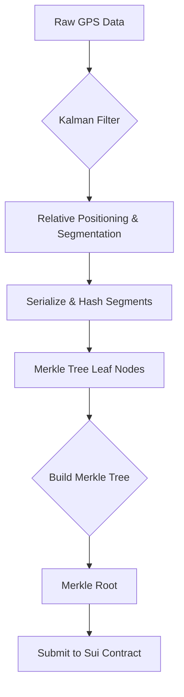

# SuiStride - Your Web3 Fitness Companion

SuiStride is an innovative "Run-to-Earn" dApp built on the Sui blockchain. It seamlessly combines real-world running and fitness activities with the incentive mechanisms of Web3, aiming to make exercise more fun, more valuable, and significantly lower the barrier for everyday users to enter the world of Web3.

## Core Advantages

Compared to similar products on the market, SuiStride has two main advantages:

1.  **Seamless User Experience**: We leverage Sui's ZKLogin feature to enable **one-click login with a Google account**. Users don't need to understand complex concepts like seed phrases or wallets to own an on-chain account, enjoying a smooth process identical to Web2 applications.
2.  **Rapid Cross-Platform Iteration**: Through a unique hybrid architecture, our web and mobile (iOS/Android) clients share the same core codebase. This means new features can be launched simultaneously, ensuring a consistent user experience across all platforms.

## Feature Highlights

### Mobile Support & Social Login

-   **Run-to-Earn, Anytime, Anywhere**: Full mobile support frees you from your computer. All you need is your phone to participate in all core features.
-   **Effortless User Acquisition**: Social login not only simplifies the registration process but also opens up a massive user acquisition funnel from Web2. Users can easily invite friends, greatly enhancing the app's potential for viral growth.

### Stake-to-Run & Run-to-Earn Model

Our innovative economic model is designed to incentivize real, effective exercise:

-   **Commitment and Incentive**: Users stake tokens to join a running prize pool. This serves not only as a commitment to participate but also as the source of the prize money.
-   **Reduced Incentive for Cheating**: Unlike simple airdrop models, the stake-first-then-run model filters for users who are genuinely willing to participate in physical activity, reducing the motivation for cheating through game theory.
-   **Distribution Based on Performance**: After the run, the prize pool is distributed based on the steps and rankings of all participants. The top 50% of performers share the prize money. The more you run and the higher you rank, the greater your earnings.

## Technical Deep Dive: Ensuring Fairness and Efficiency

We understand that for any Run-to-Earn application, anti-cheating is the lifeline that determines the project's success. To address this, we have designed a hybrid on-chain and off-chain verification system that is secure, efficient, and low-cost.

### Anti-Cheating and On-Chain Verification Mechanism

Our anti-cheating system is divided into two layers: client-side data processing and on-chain verification, using cryptography to ensure the authenticity and integrity of every run.

1.  **Client-Side Data Pre-processing**:
    -   **Data Smoothing (Kalman Filter)**: Raw GPS signals from mobile devices are prone to noise and drift. We use an algorithm similar to a **Kalman filter** to smooth the raw coordinate data, eliminate outliers, and produce a more accurate and realistic motion trajectory.
    -   **Privacy Protection & Data Segmentation**: To protect user privacy, the app does not upload the full GPS track. Instead, we convert the smoothed data into relative coordinates with the starting point as the origin and segment it into one-minute **`RunSegment`** chunks. Each segment contains key metrics for that period, such as start/end coordinates, average/max speed, steps, and acceleration variance.

2.  **Merkle Tree Commitment**:
    -   All `RunSegment`s are deterministically serialized into binary data locally. Each segment is then hashed using SHA-256 to form the leaf nodes of a Merkle tree.
    -   By hashing layer by layer, a single, unique **Merkle Root** is generated. This root acts as a "digital fingerprint" for all the detailed data of the run.

3.  **Efficient On-Chain Verification**:
    -   When a user finishes a run, they submit **only this 32-byte Merkle root and the total step count** to the chain, not the bulky GPS data.
    -   The advantages of this design are immense: it dramatically reduces gas costs for the user and avoids congesting the Sui network. The smart contract only needs to store this "digital fingerprint" to cryptographically commit to the entire workout session.
    -   In the future, if a dispute arises, a verifier (either us or the community) can run an off-chain verification program. A user would only need to provide the raw data for a specific `RunSegment` and its corresponding Merkle proof to validate it against the on-chain root, enabling trustless arbitration.


*Figure 1: Anti-cheating workflow from GPS data to on-chain Merkle root.*

### Smart Contract Architecture (Sui Move)

The contracts are located in `sui_contract/sui_stride/sources/` and consist of the following main modules and objects:

-   **`core.move`**: Implements all core logic.
    -   **`StakingPool<T>`**: A shared object that is central to the activity. It defines the prize pool's name, duration, participant list, and treasury.
    -   **`UserData`**: An owned object for each user, storing persistent data like total steps and staking information.
    -   **`Session`**: A temporary, owned object created when a user starts a run and destroyed upon completion. It includes a nonce related to the current epoch, effectively preventing "replay attacks" of the same run data.
-   **Key Functions**:
    -   `create_pool`: Creates a new running prize pool.
    -   `stake`: Allows a user to stake tokens and join a pool.
    -   `start_run`: Begins a run, creating a `Session` object.
    -   `submit_run_with_proof`: Submits the run result, including the total steps and Merkle root, and destroys the `Session` object.
    -   `distribute_rewards`: After a pool's duration ends, this function distributes rewards to the winners based on a ranking algorithm.

### Frontend Architecture

We use a modern tech stack to ensure development efficiency and a high-quality user experience.

-   **Web Application**:
    -   **Framework**: Next.js 14 (App Router)
    -   **Language**: TypeScript
    -   **UI**: React, Tailwind CSS, shadcn/ui
    -   **State Management**: React Context (`AuthProvider`) to uniformly manage wallet and ZKLogin states.
    -   **Maps**: Leaflet.js

-   **Mobile Application**:
    -   **Framework**: React Native (Expo)
    -   **Core Architecture**: **WebView Hybrid Model**. The app embeds a WebView to render our Next.js web application directly, achieving maximum code reuse.
    -   **Native Bridge**: The WebView communicates with the React Native layer via the `postMessage` API. This allows the web app to invoke native functionalities, such as:
        -   **`useLocationTracking`**: Accesses the native GPS module for more accurate and power-efficient location data than a browser can provide.
        -   **`WebBrowser.openAuthSessionAsync`**: Calls a native browser window to handle the ZKLogin OAuth flow, providing better security and user experience than a WebView redirect.

```mermaid
graph LR

subgraph "User's Device"
    direction LR
    subgraph "React Native App (Expo)"
        direction TB
        B[WebView]
        C[Native Modules]
    end
    A[Next.js Web App]
end

subgraph "Cloud / Blockchain"
    direction LR
    E[Sui Blockchain]
    F[Enoki (ZKLogin)]
end

A -- "Renders In" --> B
C -- "Provides GPS & Auth UI" --> A
B -- "postMessage Bridge" --> C
A -- "Executes Transactions" --> E
A -- "Handles Auth Flow" --> F
```
*Figure 2: Hybrid architecture for Web and Mobile.*

## Installation and Running

1.  **Clone the repository**
    ```bash
    git clone https://github.com/your-repo/suistride.git
    cd suistride
    ```

2.  **Install dependencies**
    ```bash
    bun install
    ```

3.  **Configure environment variables**
    Copy `.env.example` to `.env` and fill in your Sui network RPC address, contract package ID, etc.

4.  **Run the development server**
    ```bash
    bun run dev
    ```

## Contribution Guide

We welcome all community contributions! Please refer to `CONTRIBUTING.md` for more details.

## License

This project is licensed under the [MIT](LICENSE) License.
